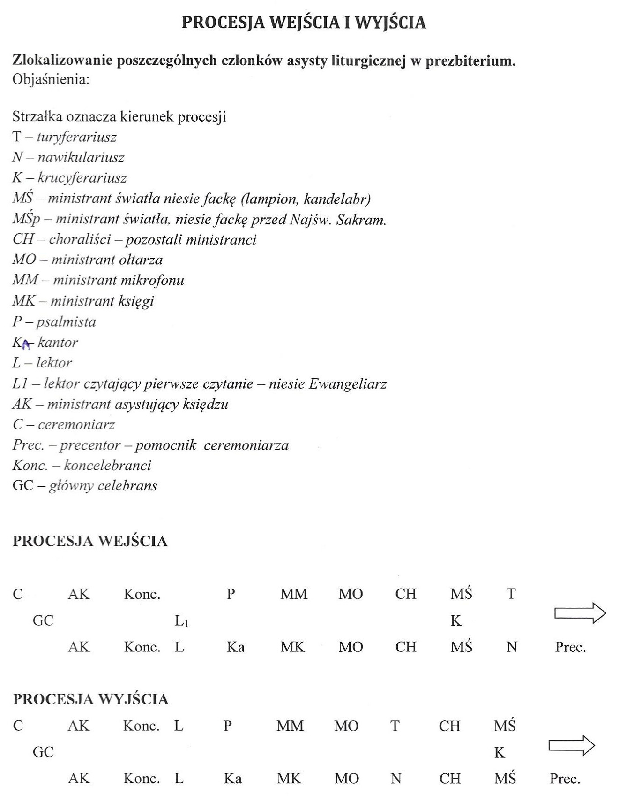
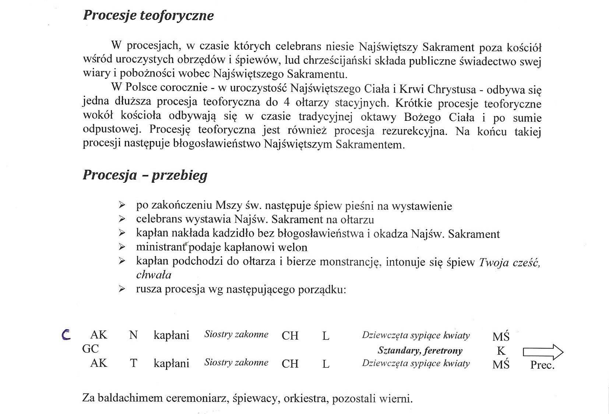

# Procesje

## Procesja wejścia i wyjścia

Poniższy układ stosuje się w _Introitus solemnis_ \(uroczystej procesji wejścia – długą drogą\).  
Natomiast w _Introitus simplex_ \(zwykłej procesji wejścia – krótką drogą\) nie wnosi się żadnych paramentów liturgicznych \(przedmiotów używanych w liturgii\).

W procesjach wyjścia obowiązują podobne zasady jak przy procesjach wejścia – niesie się tylko Krzyż i akolitki przy uroczystym wyjściu lub nic przy zwykłym.

Ministranci niosący:

* trybularz,
* łódkę,
* krzyż,
* akolitkę,
* Ewangeliarz

nie przyklękają po przyjściu przed stopnie ołtarza, a jedynie czynią skłon ciała i udają się na swoje miejsca. **Pozostali ministranci przyklękają.**

Ceremoniarz, ministranci towarzyszący celebransowi \(lub diakoni\) oraz ministranci wyznaczeni do Episkopaliów przyklękają razem z celebransem.

## Procesja teoforyczna

Dotychczasowe trasy procesji: [http://bit.ly/mapaparafia](http://bit.ly/mapaparafia)



## Procesja z darami

### Ogólne Wprowadzenie do Mszału Rzymskiego 2002

**140.** Jest wskazane, aby udział wiernych uwidocznił się przez złożenie czy to chleba i wina do sprawowania Eucharystii, czy też innych darów na potrzeby Kościoła i ubogich.  
Dary wiernych może kapłan przyjmować przez akolitę lub innego ministranta. Chleb i wino do Eucharystii wręcza się celebransowi, który zanosi je na ołtarz; pozostałe zaś dary składa się w innym odpowiednim miejscu \(por. nr 73\).

**73.** Na początku Liturgii eucharystycznej przynosi się do ołtarza dary, które staną się Ciałem i Krwią Chrystusa. Najpierw przygotowuje się ołtarz, czyli stół Pański, będący ośrodkiem całej Liturgii eucharystycznej; umieszcza się na nim korporał, puryfikaterz, mszał i kielich, chyba że przygotowuje się go przy kredensie.  
Następnie przynosi się dary na ofiarę: godne uznania jest, jeśli wierni przynoszą chleb i wino, które przyjmuje od nich kapłan albo diakon, aby je następnie złożyć na ołtarzu. Chociaż wierni tak jak dawniej nie składają już chleba i wina przeznaczonych do liturgii ze swoich własnych darów, obrzęd przyniesienia ich do ołtarza zachowuje swoją wymowę i duchowe znaczenie. Pożądane jest także przynoszenie przez wiernych lub zbieranie w kościele pieniędzy albo innych darów przeznaczonych na potrzeby ubogich lub kościoła; składa się je w odpowiednim miejscu obok stołu eucharystycznego.

### Wskazania Episkopatu Polski po ogłoszeniu nowego wydania Ogólnego Wprowadzenia do Mszału Rzymskiego

**27.** „Po zakończeniu modlitwy powszechnej wszyscy siadają i rozpoczyna się śpiew na przygotowanie darów. Akolita albo inny świecki ministrant umieszcza na ołtarzu korporał, puryfikaterz, kielich, palkę i mszał” \(OWMR 139\). **Czynności związanych z przygotowaniem darów oraz umieszczenie na ołtarzu wszystkiego, co potrzeba, nie wolno rozpocząć przed zakończeniem modlitwy powszechnej.** Po przygotowaniu ołtarza przynoszone są dary chleba i wina. Zaleca się, aby te owoce ziemi i pracy człowieka, wyrażające ludzki udział w ofierze Chrystusa, były przynoszone w sposób uroczysty, w procesji. Do ołtarza można także przynosić dary na potrzeby ubogich lub kościoła. W czasie całego obrzędu przygotowania darów \(łącznie z procesją\) wierni siedzą do wezwania „Módlcie się...” wyłącznie i wykonują odpowiednio dobrany śpiew \(zob. OWMR 74, 139\), jeśli używa się kadzidła, wierni wstają na okadzenie kapłana.

**28.** „Chleb i wino stają się poniekąd symbolem wszystkiego, co zgromadzenie eucharystyczne przynosi od siebie w darze Bogu i co ofiaruje w duchu” \(Jan Paweł II, List o tajemnicy i kulcie Eucharystii nr 9\). W procesji należy przynosić dary wyrażające jednocześnie duchowe ofiary człowieka. Taką funkcję spełniają przede wszystkim dary chleba i wina przeznaczone do konsekracji.„Natura znaku domaga się tego, by materia służąca do sprawowania Eucharystii miała wygląd pokarmu. Wynika stąd, że chleb eucharystyczny, jakkolwiek niekwaszony i w formie tradycyjnej, powinien być tak przyrządzony, aby kapłan w czasie Mszy z ludem mógł rzeczywiście przełamać Hostię na kilka części i rozdzielić przynajmniej niektórym wiernym. Nie wyklucza się jednak małych hostii, gdy wymaga tego większa liczba przyjmujących Komunię świętą lub inne racje duszpasterskie” \(OWMR 321\).  
„Chrześcijanie od początku przynoszą na Eucharystię, wraz z chlebem i winem, dary, które mają być rozdane potrzebującym. Ten zwyczaj kolekty, zawsze aktualny, czerpie z przykładu Chrystusa, który stał się ubogi, aby nas ubogacić: «Kogo stać na to, a ma dobrą wolę, ofiarowuje datki, jakie chce i może, po czym całą zbiórkę składa się na ręce przełożonego. Roztacza on opiekę nad sierotami, wdowami, chorymi lub też cierpiącymi niedostatek z innego powodu, a także nad więźniami oraz przebywającymi w gminie, jednym słowem spieszy z pomocą wszystkim potrzebującym»” \(KKK 1351\). Dary materialne składa się w odpowiednim miejscu obok stołu eucharystycznego \(zob. OWMR 73\).

**29.** W przygotowywaniu darów i przynoszeniu ich w procesji do ołtarza należy zachować następujące zasady:  
Naczynia z chlebem i ampułki z winem i wodą należy przed Mszą świętą przygotować w odpowiednim miejscu kościoła. Wyznaczone osoby przynoszą je w czasie obrzędu przygotowania darów i wręczają kapłanowi. On je przyjmuje i przy ołtarzu przedstawia Bogu w modlitwie.  
Jeśli oprócz chleba i wina niesie się także dary na potrzeby biednych lub kościoła, należy je nieść na początku procesji. Na końcu idą osoby niosące chleb i wino.  
Dary pieniężne powinno się zbierać tylko w czasie przygotowania darów. Nie należy rozpoczynać zbierania wcześniej, ani też przedłużać na czas Modlitwy eucharystycznej, a więc trzeba je zakończyć przed prefacją. W niektórych przypadkach konieczne jest wyznaczenie do tej funkcji więcej osób. Tej składki nie powinien zbierać kapłan przewodniczący celebracji.

## Bibliografia

* Duszpasterstwo Służby Liturgicznej Archidiecezji Poznańskiej, _Kurs Ceremoniarza_
* _Ogólne Wprowadzenie do Mszału Rzymskiego 2002_, Pallottinum, Poznań 2006
* Komisja Konferencji Episkopatu Polski ds. Kultu Bożego i Dyscypliny Sakramentów, _Wskazania Episkopatu Polski po ogłoszeniu Nowego Wydania Ogólnego Wprowadzenia do Mszału Rzymskiego_, Warszawa 2005

