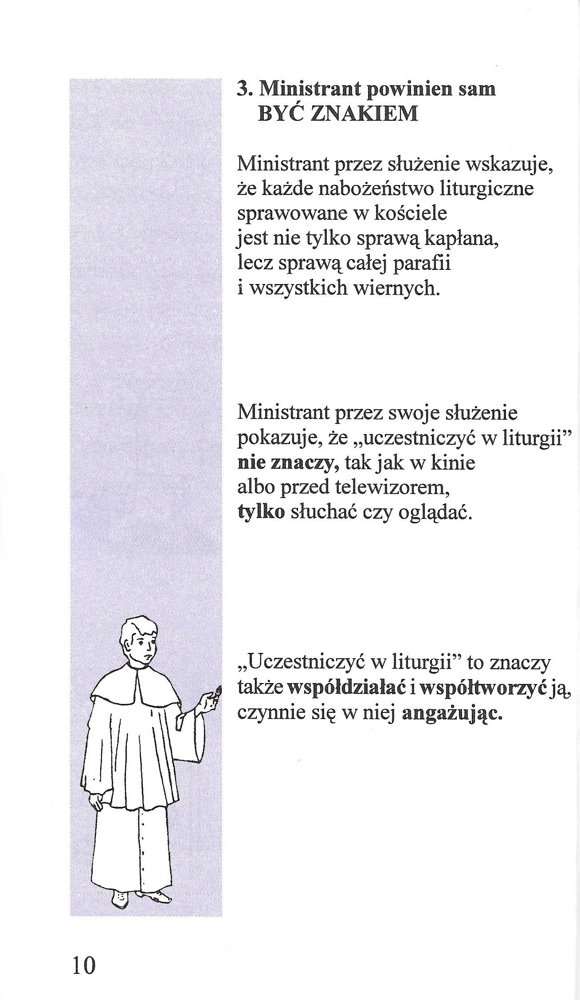

# Ministrant

## Kto to jest ministrant?

### Patroni ministrantów

Do patronów ministrantów należą:

* Św. Tarcjusz – męczennik rzymski, III wiek
* **Św. Stanisław Kostka** – XVI wiek \(Polska\)
* Św. Alojzy Gonzaga – XVI wiek \(Włochy\)
* Św. Jan Berchmans – XVII wiek \(Belgia\)
* Św. Dominik Savio – XIX wiek \(Włochy\)

> **Ministrant swoim zachowaniem daje wzór nie tylko podczas liturgii, w kościele. Powinien być przykładem dla innych także w szkole, w domu, w każdym innym miejscu.**

### **Dlaczego warto być ministrantem?**



