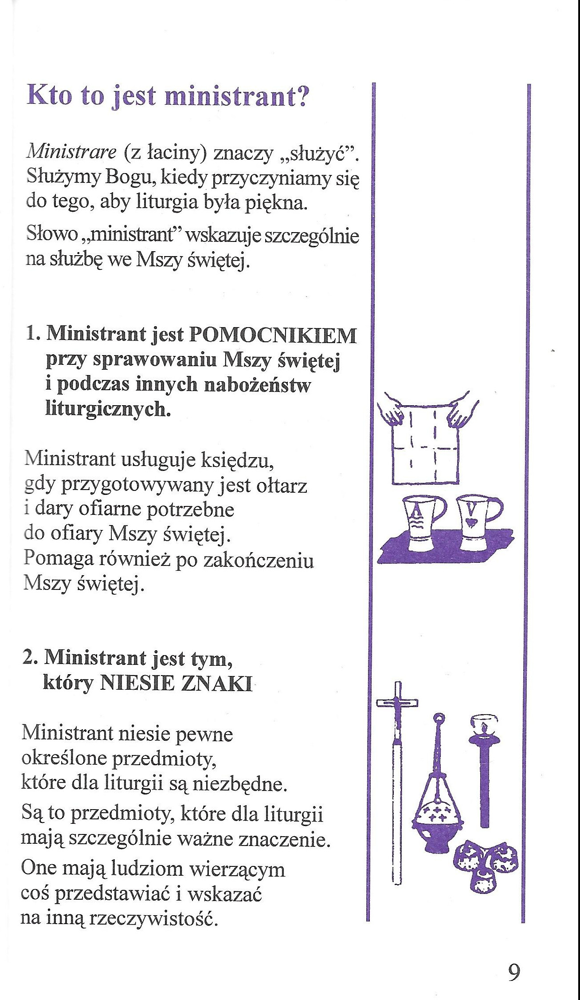
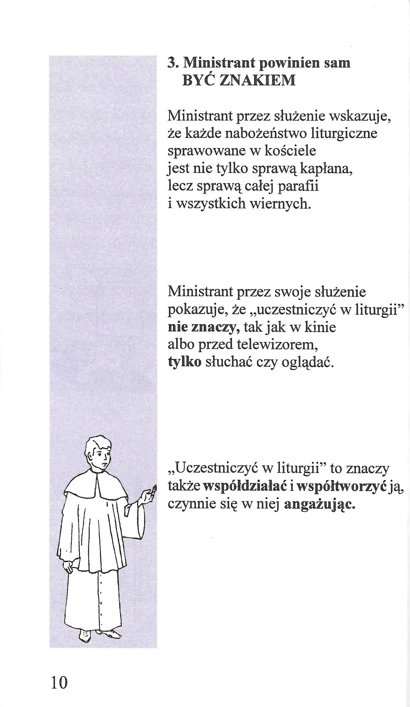

# Ministrant

## Kto to jest ministrant?

### Patroni ministrantów

Do patronów ministrantów należą:

* Św. Tarcjusz – męczennik rzymski, III wiek
* **Św. Stanisław Kostka** – XVI wiek (Polska)
* Św. Alojzy Gonzaga – XVI wiek (Włochy)
* Św. Jan Berchmans – XVII wiek (Belgia)
* Św. Dominik Savio – XIX wiek (Włochy)

> **Ministrant swoim zachowaniem daje wzór nie tylko podczas liturgii, w kościele. Powinien być przykładem dla innych także w szkole, w domu, w każdym innym miejscu.**

### **Dlaczego warto być ministrantem?**


Michał Borek, Dlaczego warto być ministrantem? 5 życiowych nauk z 17-letniej służby przy ołtarzu \[dostęp: 15:13 18.07.2019]



Papież Franciszek, Przesłanie do francuskich ministrantów \[dostęp: 17:37 17.11.2019]

