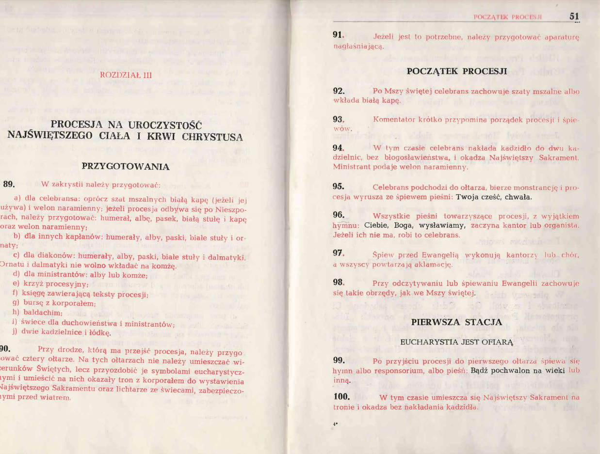
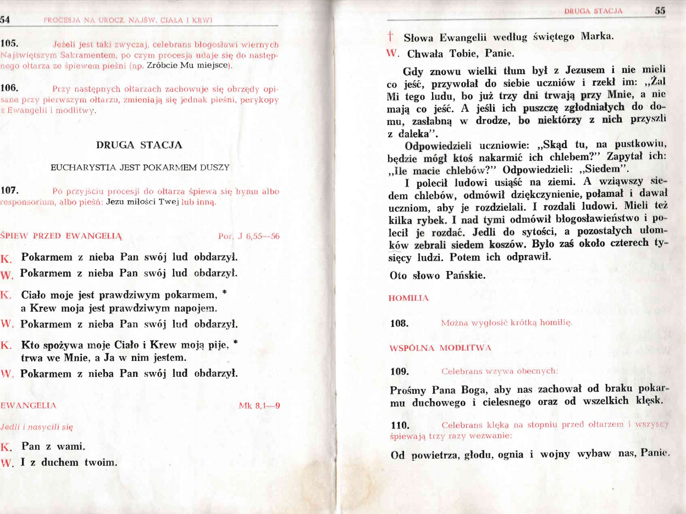
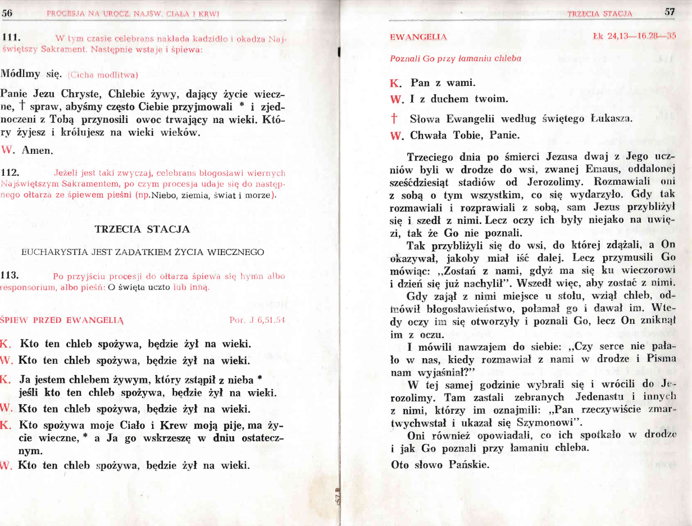
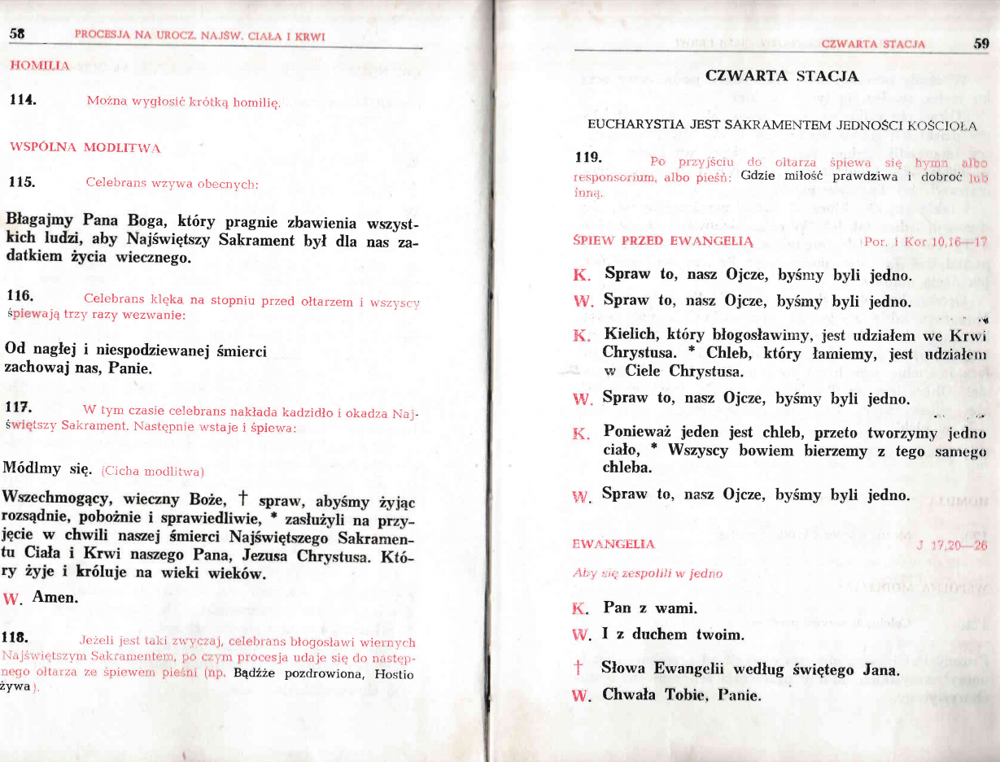
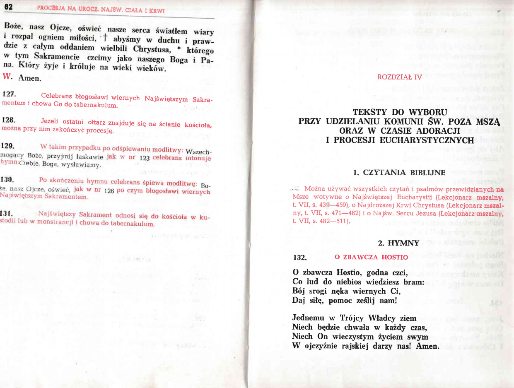

# Uroczystość Bożego Ciała

## **Uroczystość Najświętszego Ciała i Krwi Chrystusa**

W pierwszy czwartek po Niedzieli Trójcy Przenajświętszej, obchodzi się **Uroczystość Najświętszego Ciała i Krwi Chrystusa** \(pot. Boże Ciało\).


Nie ma wspomnienia tajemnicy dnia w Modlitwach Eucharystycznych.


Po sumie, odbywa się procesja eucharystyczna do 4 ołtarzy, której układ oraz przebieg przedstawiono poniżej.


Błogosławieństwo kończące procesję wykonuje się w 4 strony świata.


